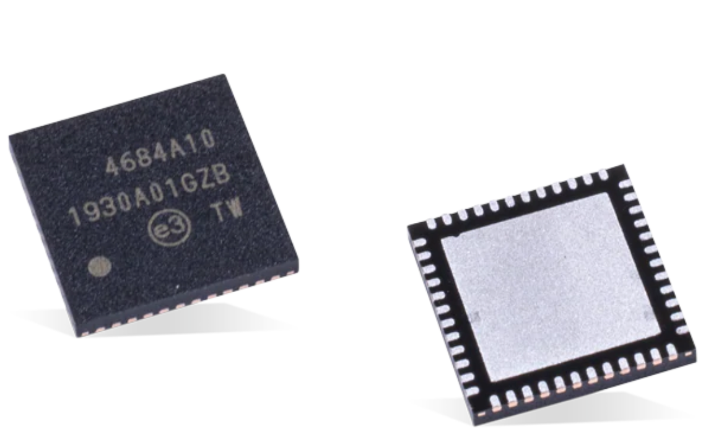
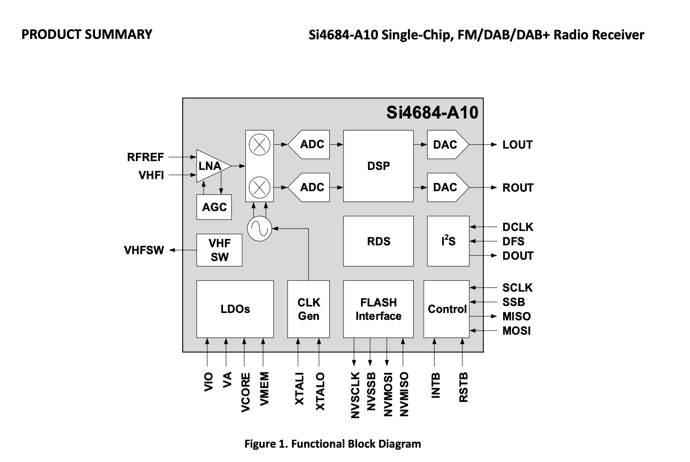
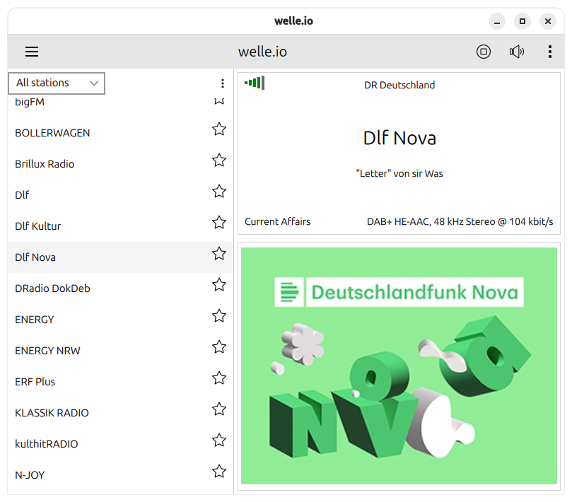
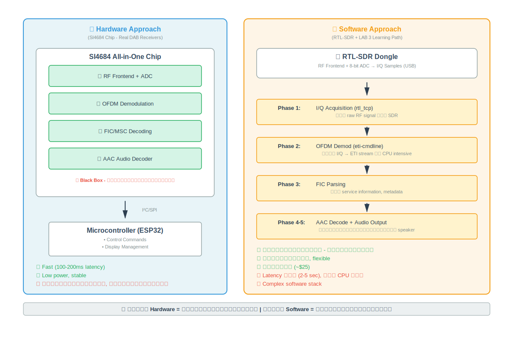
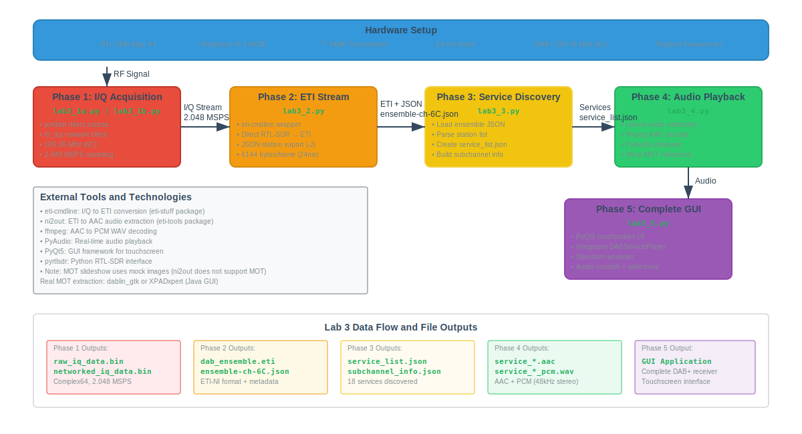
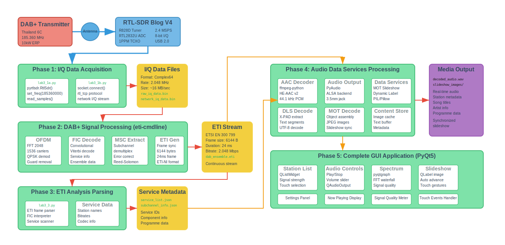

<style>

section {
  font-size: 1.70em;
  padding: 2em;
}
section table { font-size: 16px; }
h1 {
  font-size: 1.25em;
}
h2 {
  font-size: 0.825em;
}
h3 {
  font-size: 0.75em;
}
li, p, td {
  font-size: 0.81em;
}
.columns {
  display: grid;
  grid-template-columns: repeat(2, minmax(0, 1fr));
  gap: 1rem;
}
code {
    font-size: 9px;
}
pre {
    font-size: 14px;
    line-height: 1.25;
    padding: 12px;
  }
  pre code {
    font-size: inherit;
        font-family: 'Fira Code', monospace;
  }
.code-small {
  font-size: 0.5em;
}
</style>

# 📻 DAB+ Labs สำหรับ Raspberry Pi

## คู่มือการเรียนรู้ Digital Audio Broadcasting Plus
### พร้อม RTL-SDR และ PyQt5

เวอร์ชัน 1.1 | กันยายน 2025

---

# 🎯 วัตถุประสงค์โครงการ

<div class="columns">
<div>

## 📚 เรียนรู้เทคโนโลยี
- **DAB+** จากพื้นฐานจนถึงขั้นสูง  
- **Python & PyQt5** GUI programming
- **Software Defined Radio** (SDR)
- **RF Signal Processing**

</div>
<div>

## 🛠️ สร้างแอปพลิเคชัน
- DAB+ Station Scanner
- Program Recorder
- Signal Analyzer
- Touch-Friendly GUI

</div>
</div>

**🎯 เป้าหมาย**: สร้างแอปที่ใช้งานได้จริงบน Raspberry Pi

---

# 🔧 ข้อกำหนดระบบ

<div class="columns">
<div>

## 🖥️ Hardware
- **Raspberry Pi 4** (4GB+ RAM)
- **RTL-SDR V4** Dongle
- **หน้าจอสัมผัส 7"** (HDMI)
- **หูฟัง 3.5mm**
- **เสาอากาศ DAB+**

</div>
<div>

## 💿 Software  
- **Raspberry Pi OS Bookworm**
- **Python 3.11+**
- **PyQt5** GUI Framework
- **welle.io** DAB+ Decoder
- **RTL-SDR** Libraries

</div>
</div>

---

# 📚 ภาพรวมแล็บทั้งหมด

## 🎯 Lab Series พื้นฐาน (เดิม - เน้น tools)
| Lab | หัวข้อ | เวลา | ระดับ |
|-----|--------|------|--------|
| **1** | การตั้งค่าเบื้องต้น RTL-SDR | 20 นาที | ⭐⭐ |
| **2** | การรับสัญญาณ DAB+ พื้นฐาน | 25 นาที | ⭐⭐⭐ |
| **3** | Command Line Tools สำหรับ DAB+ | 15 นาที | ⭐⭐⭐ |
| **4** | ETISnoop Analysis | 15 นาที | ⭐⭐⭐⭐ |
| **5** | สรุปและวิเคราะห์ขั้นสูง | 10 นาที | ⭐⭐⭐⭐⭐ |

**รวมเวลา**: ~1.25 ชั่วโมง (75 นาที) | **🎯 เป้าหมาย**: เรียนรู้การใช้งาน DAB+ tools

---

# 📚 ภาพรวมแล็บทั้งหมด (ต่อ)

## 🚀 Lab Series ขั้นสูง (ใหม่ - เน้น development + trap exercises)
| Lab | หัวข้อ | เวลา | ระดับ |
|-----|--------|------|--------|
| **1** | RTL-SDR Setup + Hardware Detection Traps | 2 ชั่วโมง | ⭐⭐⭐ |
| **2** | welle.io Integration + Audio Routing Traps | 2 ชั่วโมง | ⭐⭐⭐⭐ |
| **3** | pyrtlsdr Spectrum Analysis + IQ Processing Traps | 2 ชั่วโมง | ⭐⭐⭐⭐ |
| **4** | DAB+ Station Scanner + Database Traps | 2 ชั่วโมง | ⭐⭐⭐⭐ |
| **5** | Program Recorder + Scheduling Traps | 2 ชั่วโมง | ⭐⭐⭐⭐⭐ |
| **6** | Signal Analyzer + OFDM Analysis Traps | 2 ชั่วโมง | ⭐⭐⭐⭐⭐ |

**รวมเวลา**: ~12 ชั่วโมง | **🎯 เป้าหมาย**: สร้าง professional DAB+ applications

---

# 🎓 LAB 0: Introduction to DAB+, Python, FRP และ PyQt5
## 🕒 เวลารวม: 105 นาที (1 ชั่วโมง 45 นาที)

### 📋 ภาพรวมเนื้อหา
**เป็นแล็บพื้นฐานสำหรับมือใหม่** ที่ยังไม่เคยใช้ Python หรือไม่รู้จัก DAB+

---

# 📡 ส่วนที่ 1: DAB+ Technology (15 นาที)

<div class="columns">
<div>

## 🆚 DAB+ vs FM Radio
- **เสียงดิจิทัล** ไม่มี static หรือสัญญาณรบกวน
- **คุณภาพคงที่** ไม่ขึ้นกับระยะทาง
- **Metadata** ชื่อเพลง, ศิลปิน แบบ real-time
- **MOT Slideshow** รูปภาพ album art
- **Multiplexing** หลายสถานีใช้ความถี่เดียว

</div>
<div>

## 🇹🇭 DAB+ ในประเทศไทย (Sep 2025)
**สถานีทดสองออกอากาศ:**
- **Block 9A**: 202.928 MHz Dharma Radio Station (Bangkok)
- **Block 6C**: 185.360 MHz Khon Kaen Station (Khon Kaen, Maha Sarakham)


see: https://www.worlddab.org/countries/thailand
</div>
</div>

## 🛠️ เทคโนโลยีที่ใช้
- **RTL-SDR**: ตัวรับสัญญาณ USB (~500-1500 บาท)
- **welle.io**: DAB+ decoder แบบ open source
- **Python**: สำหรับควบคุมและประมวลผล

---

# 🐍 ส่วนที่ 2: Python สำหรับมือใหม่ (30 นาที)

<div class="columns">
<div>

## 📝 Python Basics
```python
# Variables และ Data Types
name = "สวัสดี"       # String
age = 25              # Integer
height = 175.5        # Float
is_student = True     # Boolean

# Lists และการใช้งาน
fruits = ["แอปเปิ้ล", "กล้วย", "ส้ม"]
fruits.append("มะม่วง")
print(len(fruits))    # แสดง: 4
```

</div>
<div>

## 🔄 Control Flow
```python
# Loops (การวนซ้ำ)
for fruit in fruits:
    print("ผลไม้:", fruit)

# Conditions (เงื่อนไข)
if age >= 18:
    print("เป็นผู้ใหญ่แล้ว")
else:
    print("เป็นเด็ก")

# Functions (ฟังก์ชัน)
def say_hello(name):
    return "สวัสดี " + name
```

</div>
</div>

---

# 🐍 Python: Classes และ Hardware Integration

<div class="columns">
<div>

## 🏗️ Object-Oriented Programming
```python
class DABStation:
    def __init__(self, name, frequency):
        self.name = name
        self.frequency = frequency
        self.is_playing = False

    def start_playing(self):
        self.is_playing = True
        print(f"เริ่มเล่น {self.name}")

    def stop_playing(self):
        self.is_playing = False
```

</div>
<div>

## 🔧 Raspberry Pi GPIO
```python
try:
    import RPi.GPIO as GPIO
    import time

    # ตั้งค่า GPIO pin 18
    GPIO.setmode(GPIO.BCM)
    GPIO.setup(18, GPIO.OUT)

    # กะพริบ LED
    GPIO.output(18, GPIO.HIGH)
    time.sleep(1)
    GPIO.output(18, GPIO.LOW)

except ImportError:
    print("ทำงานบนคอมพิวเตอร์ทั่วไป")
```

</div>
</div>

---

# 🌐 ส่วนที่ 3: FRP Client Setup (30 นาที)

<div class="columns">
<div>

## 🔌 FRP คืออะไร?
**Fast Reverse Proxy** - เครื่องมือสำหรับเข้าถึง RPI จากภายนอก

**ปัญหาที่แก้:**
- RPI อยู่หลัง NAT/Router
- IP บ้านเปลี่ยนบ่อย
- ไม่สามารถเปิด port forward
- ต้องการเชื่อมต่อจาก Colab

**การทำงาน:**
```
[RPI:1234] → [FRP Client] → Internet
→ [FRP Server:600x] ← [Colab/Client]
```

</div>
<div>

## 🛠️ ติดตั้ง FRP Client
```bash
# ตรวจสอบ architecture
uname -m  # aarch64 = ARM64

# ดาวน์โหลด FRP
wget https://github.com/fatedier/frp/\
releases/download/v0.61.0/\
frp_0.61.0_linux_arm64.tar.gz

# แตกไฟล์และติดตั้ง
tar -xzf frp_*.tar.gz
cd frp_*
sudo cp frpc /usr/local/bin/
sudo chmod +x /usr/local/bin/frpc

# ตรวจสอบ
frpc --version
```

</div>
</div>

---

# 🌐 FRP: การตั้งค่าและทดสอบ

<div class="columns">
<div>

## 📝 สร้าง Config File
```bash
sudo mkdir -p /etc/frp
sudo nano /etc/frp/frpc.toml
```

**เนื้อหาไฟล์** (เปลี่ยน XX = เลขที่นั่ง):
```toml
serverAddr = "xxx.xxx.xxx.xxx"
serverPort = 7000
auth.method = "token"
auth.token = "YourToken"

[[proxies]]
name = "piXX-tcp-1234"
type = "tcp"
localIP = "127.0.0.1"
localPort = 1234
remotePort = 60XX
```

</div>
<div>

## ⚙️ ตั้งค่า Systemd Service
```bash
# สร้างไฟล์ service
sudo nano /etc/systemd/system/frpc.service
```

```ini
[Unit]
Description=FRP Client Service
After=network.target

[Service]
Type=simple
User=pi
Restart=on-failure
ExecStart=/usr/local/bin/frpc \
  -c /etc/frp/frpc.toml

[Install]
WantedBy=multi-user.target
```

</div>
</div>

---

# 🌐 FRP: เปิดใช้งานและทดสอบ

<div class="columns">
<div>

## 🚀 เริ่มต้น FRP Service
```bash
# โหลด config
sudo systemctl daemon-reload

# เปิดใช้งานอัตโนมัติ
sudo systemctl enable frpc

# เริ่มต้น service
sudo systemctl start frpc

# ตรวจสอบสถานะ
sudo systemctl status frpc
# ต้องเห็น: "start proxy success"

# ดู log
sudo journalctl -u frpc -f
```

</div>
<div>

## ✅ ทดสอบจาก Google Colab
```python
import socket

# ใส่ข้อมูลของคุณ
FRP_SERVER = "xxx.xxx.xxx.xxx"
FRP_PORT = 60XX  # เช่น 6001

sock = socket.socket(
    socket.AF_INET,
    socket.SOCK_STREAM
)
sock.settimeout(5)
result = sock.connect_ex(
    (FRP_SERVER, FRP_PORT)
)

if result == 0:
    print("✅ เชื่อมต่อสำเร็จ!")
else:
    print("❌ ไม่สามารถเชื่อมต่อ")
sock.close()
```

</div>
</div>

**🎯 ผลลัพธ์**: เข้าถึง RPI จากภายนอกได้ผ่าน FRP tunnel

---

# 🖥️ ส่วนที่ 4: PyQt5 Hands-on (30 นาที)

<div class="columns">
<div>

## 🧩 PyQt5 Components
```python
from PyQt5.QtWidgets import *
import sys

class MainWindow(QMainWindow):
    def __init__(self):
        super().__init__()
        self.setup_ui()

    def setup_ui(self):
        # สร้าง central widget
        central_widget = QWidget()
        self.setCentralWidget(central_widget)

        # สร้าง layout
        layout = QVBoxLayout(central_widget)
```

</div>
<div>

## 📱 Touch-Friendly Design
```python
# ปุ่มขนาดใหญ่สำหรับสัมผัส
button = QPushButton("กดที่นี่")
button.setMinimumSize(120, 60)

# Font ขนาดใหญ่
font = QFont()
font.setPointSize(14)
button.setFont(font)

# CSS Styling
button.setStyleSheet("""
    QPushButton {
        border-radius: 8px;
        background: #3498db;
        color: white;
    }
""")
```

</div>
</div>

---

# 🖥️ PyQt5: Signals & Slots

<div class="columns">
<div>

## 🔗 Event Handling
```python
class DABPlayerWidget(QWidget):
    def __init__(self):
        super().__init__()
        self.setup_ui()
        self.setup_connections()

    def setup_connections(self):
        # เชื่อม signals กับ slots
        self.play_button.clicked.connect(self.on_play)
        self.volume_slider.valueChanged.connect(self.on_volume_change)

    def on_play(self):
        print("เริ่มเล่นเพลง!")
```

</div>
<div>

## ⏱️ QTimer และ Updates
```python
from PyQt5.QtCore import QTimer

class SignalMonitor(QWidget):
    def __init__(self):
        super().__init__()

        # Timer สำหรับ real-time update
        self.timer = QTimer()
        self.timer.timeout.connect(self.update_signal)
        self.timer.start(1000)  # อัพเดททุก 1 วินาที

    def update_signal(self):
        # อัพเดทค่าสัญญาณ
        signal_strength = self.get_signal_strength()
        self.signal_bar.setValue(signal_strength)
```

</div>
</div>

---

# 🎯 LAB 0: Demo Applications

<div class="columns">
<div>

## 📱 Demo 1: Basic Widgets
- **QLabel** แสดงข้อความและรูปภาพ
- **QPushButton** ปุ่มกดขนาดใหญ่
- **QLineEdit** ช่องใส่ข้อความ
- **QTextEdit** พื้นที่ข้อความหลายบรรทัด
- **QSlider** แถบเลื่อนค่า
- **QProgressBar** แสดงความคืบหน้า

</div>
<div>

## 📱 Demo 2: Touch Interface
- **ขนาดปุ่ม** อย่างน้อย 60x40 pixels
- **Font Size** 12-16pt สำหรับหน้าจอ 7"
- **Visual Feedback** เปลี่ยนสีเมื่อกด
- **Layout Management** responsive design
- **Error Handling** การจัดการข้อผิดพลาด

</div>
</div>

### ✅ สิ่งที่นักเรียนต้องเติม:
1. **อ่านชื่อ** จาก QLineEdit และแสดงใน QLabel
2. **ควบคุม QProgressBar** ด้วย QSlider
3. **เริ่ม/หยุด QTimer** และแสดงเวลาปัจจุบัน
4. **เปลี่ยนสี** ของปุ่มเมื่อกด (CSS styling)

---

# 🏆 LAB 0: ผลลัพธ์ที่คาดหวัง

<div class="columns">
<div>

## 🎯 ความรู้ที่ได้รับ
**DAB+ Technology:**
- เข้าใจความแตกต่างจาก FM
- รู้จักเทคโนโลยี RTL-SDR
- เข้าใจ DAB+ ในประเทศไทย

**Python Programming:**
- Variables, functions, classes
- File handling และ modules
- GPIO programming พื้นฐาน

**FRP Remote Access:**
- ติดตั้ง FRP Client
- ตั้งค่า systemd service
- Remote tunneling concepts

</div>
<div>

## 🛠️ Skills ที่พร้อมใช้
**PyQt5 GUI Development:**
- Widget การใช้งานพื้นฐาน
- Signals & Slots system
- Touch-friendly UI design
- Real-time updates ด้วย QTimer

**Network & Remote:**
- FRP tunnel management
- Remote access จาก Colab
- Service troubleshooting

**เตรียมพร้อม** สำหรับ Labs ขั้นสูง!

</div>
</div>

### 🚀 Next Step: LAB 1 - RTL-SDR Hardware Setup

---

# 🔌 LAB 1: การตั้งค่าเบื้องต้น RTL-SDR (20 นาที)


<div>

## 🛠️ การติดตั้ง RTL-SDR Drivers
```bash
# อัพเดทระบบ
sudo apt update && sudo apt upgrade -y

# ติดตั้ง dependencies
sudo apt install libusb-1.0-0-dev git cmake pkg-config build-essential

# ดาวน์โหลดและติดตั้ง RTL-SDR Blog drivers
git clone https://github.com/rtlsdrblog/rtl-sdr-blog
cd rtl-sdr-blog
mkdir build && cd build
cmake ../ -DINSTALL_UDEV_RULES=ON
make
sudo make install
sudo ldconfig

# Blacklist DVB-T drivers
echo 'blacklist dvb_usb_rtl28xxu' | sudo tee --append /etc/modprobe.d/blacklist-dvb_usb_rtl28xxu.conf
```

</div>

---

<div class="columns">
<div>

## ✅ การทดสอบ
```bash
# รีบูทเครื่อง
sudo reboot

# ทดสอบ RTL-SDR
rtl_test -t
```

**สิ่งที่ควรตรวจสอบ:**
- [ ] RTL-SDR ถูกตรวจพบโดยระบบ
- [ ] ไม่มี error messages
- [ ] Ready สำหรับ Lab 2

</div>
</div>

---

## 🎯 Trap Exercises LAB 1:

### **Trap 1.1: Hardware Detection Challenge**
หลังรัน `lsusb` ให้วิเคราะห์ output และระบุว่า RTL-SDR อยู่ที่ port ไหน

### **Trap 1.2: Driver Permission Investigation**
หลัง blacklist DVB-T drivers ให้อธิบายทำไมต้อง blacklist และผลกระทบคืออะไร

### **Trap 1.3: PPM Calibration Analysis**
หลัง `rtl_test -t` ให้วิเคราะห์ PPM error และอธิบายความหมาย

---

# 🌐 LAB 1 Extended: rtl_tcp Server (15 นาที)

<div class="columns">
<div>

## 🖥️ การรัน rtl_tcp Server
```bash
# เริ่มต้น rtl_tcp server
rtl_tcp -a 0.0.0.0 -p 1234 -d 0

# ตรวจสอบว่า server ทำงาน
netstat -an | grep 1234

# ควรเห็น: tcp  0.0.0.0:1234  LISTEN
```

**Parameters:**
- `-a 0.0.0.0` รับ connection จากทุก IP
- `-p 1234` ใช้ port 1234
- `-d 0` เลือก RTL-SDR device 0

</div>
<div>

## 📡 rtl_tcp Protocol Commands
```python
# Command format: 1 byte + 4 bytes (big endian)
import struct

# 0x01: Set frequency (Hz)
freq_cmd = struct.pack('>BI', 0x01, 185360000)

# 0x02: Set sample rate (Hz)
rate_cmd = struct.pack('>BI', 0x02, 2048000)

# 0x03: Set gain mode (0=auto, 1=manual)
mode_cmd = struct.pack('>BI', 0x03, 1)

# 0x04: Set gain (tenths of dB)
gain_cmd = struct.pack('>BI', 0x04, 200)  # 20.0 dB

# 0x05: Set frequency correction (ppm)
ppm_cmd = struct.pack('>BI', 0x05, 0)
```

</div>
</div>

---

# 🌐 LAB 1: Python rtl_tcp Client Example

<div class="columns">
<div>

## 🔌 Network Connection
```python
import socket
import struct
import numpy as np

# เชื่อมต่อ rtl_tcp server
sock = socket.socket(
    socket.AF_INET,
    socket.SOCK_STREAM
)
sock.connect(('localhost', 1234))

# ตั้งค่าความถี่ DAB+ Thailand
freq = 185360000  # 185.360 MHz
cmd = struct.pack('>BI', 0x01, freq)
sock.send(cmd)

# ตั้งค่า sample rate
rate = 2048000    # 2.048 MHz
cmd = struct.pack('>BI', 0x02, rate)
sock.send(cmd)
```

</div>
<div>

## 📊 รับ I/Q Samples
```python
# รับข้อมูล I/Q (8192 bytes = 4096 samples)
data = sock.recv(8192)

# แปลง uint8 → float → complex
iq_uint8 = np.frombuffer(data, dtype=np.uint8)
iq_float = (iq_uint8 - 127.5) / 127.5

# แยก I และ Q
i_samples = iq_float[::2]
q_samples = iq_float[1::2]
samples = i_samples + 1j * q_samples

print(f"Received {len(samples)} complex samples")

# ปิดการเชื่อมต่อ
sock.close()
```

**ข้อดี rtl_tcp:**
- Remote access ผ่าน network
- ใช้กับ FRP tunnel ได้
- เหมาะสำหรับ Google Colab

</div>
</div>

---

# 🌐 LAB 1: ใช้งานผ่าน FRP Tunnel

<div class="columns">
<div>

## 🔄 Architecture
```
[Colab/Client]
    ↓
[Internet]
    ↓
[FRP Server:600X]
    ↓
[FRP Client on RPI]
    ↓
[rtl_tcp:1234 on RPI]
    ↓
[RTL-SDR Hardware]
```

**การตั้งค่า FRP:**
```toml
[[proxies]]
name = "piXX-tcp-1234"
type = "tcp"
localIP = "127.0.0.1"
localPort = 1234
remotePort = 60XX
```

</div>
<div>

## ✅ ทดสอบจาก Colab
```python
# ใน Google Colab
import socket
import struct

FRP_SERVER = "xxx.xxx.xxx.xxx"
FRP_PORT = 60XX  # remote port

# เชื่อมต่อผ่าน FRP
sock = socket.socket(
    socket.AF_INET,
    socket.SOCK_STREAM
)
sock.connect((FRP_SERVER, FRP_PORT))

# ตั้งค่า RTL-SDR ผ่าน network
freq = 185360000
cmd = struct.pack('>BI', 0x01, freq)
sock.send(cmd)

# รับ I/Q data จากระยะไกล
data = sock.recv(8192)
print(f"Received {len(data)} bytes via FRP")
```

</div>
</div>

**🎯 ผลลัพธ์**: สามารถควบคุม RTL-SDR จาก Colab ผ่าน FRP tunnel

---

# 📻 LAB 2: การรับสัญญาณ DAB+ พื้นฐาน (25 นาที)

<div class="columns">
<div>

## 🔧 การติดตั้ง welle.io
```bash
# ติดตั้ง welle.io จาก package manager
sudo apt install welle.io
```

## 🎛️ การตั้งค่า welle.io
- [ ] เปิดโปรแกรม welle.io
- [ ] เลือก Input Device: RTL-SDR
- [ ] ตั้งค่า Gain: Auto หรือ 20-30 dB

</div>
<div>

## 📡 ความถี่ DAB+ ในประเทศไทย (ตาม NBTC)
- [ ] **Channel 5C**: 178.352 MHz (Bangkok, Pattaya, Hua Hin)
- [ ] **Channel 6C**: 185.360 MHz (National Network)
- [ ] **Channel 7C**: 192.352 MHz (เชียงใหม่, ภาคใต้)
- [ ] **Channel 8C**: 199.360 MHz (Bangkok, Pattaya, Hua Hin)

## 🔍 ขั้นตอนการ Scan
- [ ] เลือก "Band III" (174-230 MHz)
- [ ] กด "Automatic Scan"
- [ ] รอให้ scan เสร็จ (2-3 นาที)
- [ ] ตรวจสอบ Services ที่พบ

</div>
</div>

## 🎯 Trap Exercises LAB 2:

### **Trap 2.1: Gain Setting Optimization**
ทดลองเปลี่ยน gain จาก Auto เป็น 10, 20, 30 dB และเปรียบเทียบผล

### **Trap 2.2: Channel Planning Strategy**
เลือก 2 channels จาก 4 channels ที่มี และอธิบายเหตุผลการเลือก

### **Trap 2.3: Signal Quality Assessment**
ตรวจสอบ Signal Strength > 50%, Audio Quality: Good/Excellent, Error Rate < 5%

---

# 🔬 LAB 3: Learning DAB+ with Raspberry Pi (Progressive Development)
## 🕒 เวลารวม: 8-10 ชั่วโมง (แบ่งเป็น 5 phases)

### 📋 ภาพรวม Lab 3: การพัฒนา DAB+ แบบ Step-by-Step
**เป็นแล็บหลักที่สอนการสร้าง DAB+ receiver ตั้งแต่ต้นจนจบ**


---

# 📡 Lab 3 Hardware DAB Receiver


<div style="display: flex;">
  
  
</div>

---

# 📡 Lab 3  Software DAB Receiver




---

# 📡 Lab 3 Hardware vs Software DAB Receiver




---

# 📡 Lab 3 ภาพรวมของ LAB



---

# 📡 Lab 3 รายละเอียด Technical Architecture



---

# 📡 Lab 3 Phase 1: RTL-SDR Data Acquisition

<div class="columns">
<div>

### **Phase 1a: pyrtlsdr I/Q Capture**
**เรียนรู้**: การใช้ pyrtlsdr library ควบคุม RTL-SDR เพื่อรับสัญญาณ I/Q จากความถี่ DAB+ ในประเทศไทย
```python
# lab3_1a.py - RTL-SDR พื้นฐาน
import numpy as np
from rtlsdr import RtlSdr

class DABSignalCapture:
    def __init__(self):
        self.sdr = RtlSdr()
        self.dab_freq = 185.360e6  # Thailand
        self.sample_rate = 2.048e6

    def setup_sdr(self):
        # TODO: ตั้งค่า RTL-SDR parameters
        # TODO: center frequency, sample rate, gain
        pass

    def capture_iq_data(self, duration=5):
        # TODO: รับ I/Q samples
        # TODO: คำนวณ spectrum
        # TODO: บันทึก raw data
        pass
```
**ผลลัพธ์**: สามารถรับและวิเคราะห์ spectrum ของสัญญาณ DAB+ ได้

</div>
<div>

### **Phase 1b: rtl_tcp Network Client**
**เรียนรู้**: การสร้าง TCP client เชื่อมต่อ rtl_tcp server เพื่อรับ I/Q data แบบ network streaming
```python
# lab3_1b.py - Network รับ I/Q ผ่าน TCP
import socket
import struct
import numpy as np

class RTLTCPClient:
    def __init__(self, host='localhost', port=1234):
        self.host = host
        self.port = port
        self.socket = None

    def connect_to_server(self):
        # TODO: เชื่อมต่อ rtl_tcp server
        # TODO: ส่งคำสั่งตั้งค่า frequency
        pass

    def receive_iq_stream(self):
        # TODO: รับ I/Q data แบบ streaming
        # TODO: แปลง bytes เป็น complex samples
        pass
```
**ผลลัพธ์**: สามารถรับ I/Q data ผ่าน network และเปรียบเทียบกับ USB direct connection

</div>
</div>

**🎯 ผลลัพธ์ Phase 1**: I/Q data capture, spectrum analysis, network streaming

---

# 🔄 Lab 3 Phase 2: ETI Stream Processing

<div class="columns">
<div>

### **ETI-cmdline Integration**
**เรียนรู้**: การใช้ eti-cmdline แปลงสัญญาณ I/Q จาก RTL-SDR เป็น ETI frames ขนาด 6144 bytes ต่อ frame
```python
# lab3_2.py - DAB+ Signal → ETI Conversion
# Tool path: /home/pi/DAB_Plus_Labs/eti/eti-cmdline
import subprocess
import threading

class ETIProcessor:
    def __init__(self):
        self.eti_cmdline_path = "/home/pi/DAB_Plus_Labs/eti/eti-cmdline"
        self.channel = "6C"  # DAB+ Thailand
        self.output_file = "dab_ensemble.eti"

    def run_eti_cmdline(self, runtime_seconds=30):
        # Uses RTL-SDR directly
        cmd = [
            self.eti_cmdline_path,
            "-C", self.channel,
            "-B", "BAND_III",
            "-O", self.output_file,
            "-J"  # Output JSON with service info
        ]
        # Runs subprocess and monitors output
```
**ผลลัพธ์**: dab_ensemble.eti + ensemble-ch-6C.json

</div>
<div>

### **Signal Quality Monitoring**
**เรียนรู้**: การติดตาม sync status และ error rate เพื่อประเมินคุณภาพสัญญาณ DAB+ แบบ real-time
```python
class SignalQualityMonitor:
    def monitor_process(self):
        # Parses eti-cmdline output
        # Looks for "sync found", "locked"
        # Tracks frame count
        # Reports SNR values
        pass

    def display_status(self):
        print(f"✓ DAB sync found!")
        print(f"📊 Frames processed: {frame_count}")
        print(f"- Errors: {error_count}")
```
**ผลลัพธ์**: Real-time monitoring ของ ETI generation process

**🎯 ผลลัพธ์ Phase 2**: ETI stream + JSON service list ready for Phase 3

</div>
</div>


---

# 🔍 Lab 3 Phase 3: ETI Analysis & Service Discovery

<div class="columns">
<div>

### **Simplified Service Extraction (JSON-based)**
**เรียนรู้**: การใช้ JSON output จาก eti-cmdline แทนการ parse ETI frames manual
```python
# lab3_3.py - Simple ETI Analysis
import json
import re

def load_ensemble_json(channel="6C"):
    # Load ensemble-ch-6C.json from eti-cmdline
    json_filename = f"ensemble-ch-{channel}.json"
    with open(json_filename, 'r') as f:
        content = f.read()
        # Fix malformed JSON if needed
        content = re.sub(r'"Eid:"([^"]*)"', r'"Eid":"\1"', content)
        data = json.loads(content)
    return data

def create_service_list(ensemble_data):
    # Extract service information
    stations = ensemble_data.get('stations', {})
    services = []
    for station_name, service_id_hex in stations.items():
        service_id = int(service_id_hex, 16)
        services.append({
            'label': station_name,
            'service_id': service_id,
            'service_id_hex': service_id_hex
        })
    return services
```
**ผลลัพธ์**: Parsed service list from JSON - no manual FIC parsing required!

</div>
<div>

### **Service List Export**
**เรียนรู้**: การสร้าง service_list.json สำหรับ Phase 4 audio playback
```python
def create_service_list(ensemble_data):
    service_list = {
        'timestamp': datetime.now().isoformat(),
        'ensemble_info': {
            'channel': ensemble_data.get('channel'),
            'ensemble_name': ensemble_data.get('ensemble'),
            'ensemble_id': ensemble_data.get('Eid')
        },
        'services': []
    }

    # Add all discovered services
    for station_name, sid in stations.items():
        service_list['services'].append({
            'service_id': int(sid, 16),
            'label': station_name,
            'components': [...]
        })

    # Save to JSON
    with open('service_list.json', 'w') as f:
        json.dump(service_list, f, indent=2)
```
**ผลลัพธ์**: service_list.json ready for Phase 4

**🎯 ผลลัพธ์ Phase 3**: service_list.json from eti-cmdline JSON output

</div>
</div>


---

# 🎵 Lab 3 Phase 4: Audio Processing & Playback


<div class="columns">
<div>

### **ni2out Audio Extraction**
**เรียนรู้**: การใช้ ni2out tool แยก AAC audio จาก ETI และ decode ด้วย ffmpeg + PyAudio
```python
# lab3_4.py - DAB+ Audio Processing
# Tool path: /home/pi/DAB_Plus_Labs/eti/ni2out
import subprocess
import pyaudio

class DABServicePlayer:
    def __init__(self):
        self.ni2out_path = "/home/pi/DAB_Plus_Labs/eti/ni2out"
        self.eti_filename = "dab_ensemble.eti"

    def extract_audio_from_eti(self, service_id):
        # Use ni2out to extract AAC audio
        audio_filename = f"service_0x{service_id:04X}.aac"
        with open(audio_filename, 'wb') as f:
            subprocess.Popen([
                self.ni2out_path,
                '-i', self.eti_filename,
                '-s', f'0x{service_id:04X}'
            ], stdout=f)

    def decode_aac_to_pcm(self, aac_file):
        # Use ffmpeg to decode AAC → PCM
        pcm_file = aac_file.replace('.aac', '_pcm.wav')
        subprocess.run(['ffmpeg', '-i', aac_file, '-f', 'wav', pcm_file])
        return pcm_file
```
**ผลลัพธ์**: Extract AAC → Decode PCM → Play audio with PyAudio

</div>
<div>

### **⚠️ MOT Slideshow Limitations**
**Important**: ni2out does **NOT** support MOT extraction
```python
# MOT extraction NOT possible with ni2out
# Use alternative tools instead:

# Option 1: dablin_gtk (GUI)
# dablin_gtk -i dab_ensemble.eti

# Option 2: XPADxpert (Java GUI)
# java -jar XPADxpert.jar dab_ensemble.eti

# Option 3: welle-io (Full receiver)
# welle-io

# For lab3_4.py:
def extract_slideshow_images(self, service_id):
    # Creates MOCK/DEMO images for educational purposes
    # Real MOT requires dablin_gtk or XPADxpert
    print("Note: ni2out does NOT support MOT")
    print("Use dablin_gtk or XPADxpert for real MOT")
    return []  # or mock images
```
**ผลลัพธ์**: Audio works perfectly, MOT requires GUI tools

**🎯 ผลลัพธ์ Phase 4**: Working audio player with command-line options (-s, -l, --mot-info)

</div>
</div>


---

# 🖥️ Lab 3 Phase 5: Complete GUI Application


<div class="columns">
<div>

### **Touch-Optimized GUI**
**เรียนรู้**: การสร้าง PyQt5 GUI สำหรับหน้าจอสัมผัส 7" พร้อม spectrum analyzer และ dark theme
```python
# lab3_5.py - PyQt5 Complete Application
from PyQt5.QtWidgets import *
from PyQt5.QtCore import *
import pyqtgraph as pg

class DABPlusGUI(QMainWindow):
    def __init__(self):
        super().__init__()
        self.setFixedSize(800, 480)  # 7" screen
        self.setup_dark_theme()
        self.setup_main_interface()
    def setup_main_interface(self):
        # TODO: สร้าง tabbed interface
        # TODO: Spectrum tab, Services tab, Player tab
        # TODO: Settings tab สำหรับ RTL-SDR
        pass
    def setup_spectrum_analyzer(self):
        # TODO: Real-time spectrum plot
        # TODO: Waterfall display
        # TODO: Signal quality indicators
        pass
```
**ผลลัพธ์**: GUI application ที่ใช้งานง่ายบนหน้าจอสัมผัส

</div>
<div>

### **Integrated DAB+ Player**
**เรียนรู้**: การรวม Phase 1-4 เข้าด้วยกันเป็น complete pipeline จาก I/Q → Audio พร้อม GUI controls
```python
class DABPlayerController:
    def __init__(self, parent):
        self.parent = parent
        self.current_phase = 1
        self.all_components = {}

    def integrate_all_phases(self):
        # TODO: รวม Phase 1-4 เข้าด้วยกัน
        # TODO: I/Q → ETI → Services → Audio
        # TODO: Real-time processing pipeline
        pass

    def create_player_ui(self):
        # TODO: Service selection list
        # TODO: Audio controls (play/stop/volume)
        # TODO: DLS text display
        # TODO: Slideshow viewer
        # TODO: Signal quality meters
        pass
```
**ผลลัพธ์**: DAB+ receiver application ที่ทำงานครบวงจรตั้งแต่ RF จนถึงเสียง

**🎯 ผลลัพธ์ Phase 5**: Complete DAB+ receiver GUI application

</div>
</div>


---

# 🌐 Lab 3: Google Colab Version (สำหรับเรียนรู้ทางไกล)

<div class="columns">
<div>

## 📚 ทำไมต้องมี Colab Version?
**ปัญหา**:
- ไม่มี Raspberry Pi
- ไม่มี RTL-SDR
- อยากเรียนรู้ทางไกล
- ทดลองโค้ดก่อนติดตั้ง

**วิธีแก้**:
- ใช้ FRP tunnel เข้าถึง RPI
- เขียนโค้ดใน Google Colab
- ทดสอบ algorithm ได้ทันที
- Visualization พร้อมใช้

</div>
<div>

## 🔄 Architecture
```
[Google Colab Notebook]
    ↓ Python code + visualization
[rtl_tcp client via FRP]
    ↓ network connection
[FRP Server:600X]
    ↓ internet tunnel
[RPI + FRP Client]
    ↓ local connection
[rtl_tcp:1234]
    ↓ USB
[RTL-SDR Hardware]
```

**ข้อดี**:
- เรียนได้ทุกที่
- ไม่ต้องติดตั้งอะไร
- Share notebook ง่าย

</div>
</div>

---

# 🌐 Lab 3 Colab: Phase 1 - I/Q Acquisition

<div class="columns">
<div>

## 📓 Lab3_Phase1_IQ_Acquisition_Colab.ipynb
**Features:**
- RTLTCPClient class ครบถ้วน
- FRP connection testing
- I/Q sample acquisition
- Real-time monitoring

```python
# Cell 1: Setup
!pip install numpy matplotlib scipy

# Cell 2: RTLTCPClient
class RTLTCPClient:
    def __init__(self, host, port):
        self.host = host
        self.port = port
        self.sock = None

    def connect(self):
        self.sock = socket.socket(
            socket.AF_INET,
            socket.SOCK_STREAM
        )
        self.sock.connect(
            (self.host, self.port)
        )
```

</div>
<div>

## 📊 Spectrum Analysis
```python
# Cell 3: Acquire Samples
client = RTLTCPClient(
    'frp_server_ip',
    60XX
)
client.connect()
client.set_frequency(185360000)
client.set_sample_rate(2048000)

samples = client.read_samples(1024*1024)

# Cell 4: FFT Analysis
fft_data = np.fft.fft(samples)
freqs = np.fft.fftfreq(
    len(samples),
    1/2048000
)
psd = 20*np.log10(np.abs(fft_data))

plt.plot(freqs/1e6, psd)
plt.xlabel('Frequency (MHz)')
plt.ylabel('Power (dB)')
plt.show()
```

**ผลลัพธ์**: spectrum plot, I/Q data

</div>
</div>

---

# 🌐 Lab 3 Colab: Phase 2 - ETI Processing

<div class="columns">
<div>

## 📓 Lab3_Phase2_ETI_Processing_Colab.ipynb
**Features:**
- ETIFrameParser class
- Simulated ETI frames
- Sync pattern detection
- FIC data extraction

```python
# Cell 1: ETI Frame Parser
class ETIFrameParser:
    FRAME_SIZE = 6144
    FSYNC_PATTERN = 0x073AB6

    def parse_header(self, frame_bytes):
        # Parse ERR, FSYNC, LIDATA
        fsync = (frame_bytes[4] << 16) | \
                (frame_bytes[5] << 8) | \
                 frame_bytes[6]

        return {
            'fsync_valid':
                fsync == self.FSYNC_PATTERN,
            'fc': frame_bytes[7]
        }
```

</div>
<div>

## 🔍 Simulated ETI for Learning
```python
# Cell 2: Generate Simulated ETI
def generate_simulated_eti():
    frame = bytearray(6144)

    # ERR (byte 0-3)
    frame[0:4] = b'\x00\x00\x00\x00'

    # FSYNC (byte 4-6)
    frame[4] = 0x07
    frame[5] = 0x3A
    frame[6] = 0xB6

    # FC (byte 7)
    frame[7] = 0x00

    # FIC (96 bytes)
    # MSC (rest of frame)

    return bytes(frame)

# Test parsing
parser = ETIFrameParser()
frame = generate_simulated_eti()
header = parser.parse_header(frame)
print(f"Valid: {header['fsync_valid']}")
```

</div>
</div>

---

# 🌐 Lab 3 Colab: ข้อจำกัดและข้อดี

<div class="columns">
<div>

## ⚠️ ข้อจำกัด
**Network:**
- Latency จาก internet
- Bandwidth สำหรับ I/Q streaming
- FRP tunnel stability

**Processing:**
- ไม่มี eti-cmdline บน Colab
- ไม่มี native DAB+ tools
- ต้องใช้ simulated data บางส่วน

**Hardware:**
- ไม่สามารถเข้าถึง GPIO
- ไม่มี audio output ตรง
- ต้องพึ่งพา RPI ระยะไกล

</div>
<div>

## ✅ ข้อดี
**Learning:**
- เรียนรู้ concepts ได้ดี
- ทดสอบ algorithm ง่าย
- Visualization สวยงาม
- Share code ได้ทันที

**Development:**
- Prototype รวดเร็ว
- Debug ง่าย
- Version control ผ่าน Colab
- Collaborate ได้

**Accessibility:**
- เรียนได้ทุกที่ทุกเวลา
- ไม่ต้องลงทุน hardware
- เหมาะกับ workshop
- Remote teaching ready

</div>
</div>

**🎯 สรุป**: Colab version เหมาะสำหรับเรียนรู้ concepts, RPI version เหมาะสำหรับ production

---

# 🎯 Lab 3 Trap Exercises (แต่ละ Phase)

<div class="columns">
<div>

## **Phase 1 Traps:**
### **Trap 1.1: I/Q Data Analysis**
วิเคราะห์ spectrum ที่ได้และระบุ DAB+ signal peaks

### **Trap 1.2: Network Protocol**
อธิบายความแตกต่างระหว่าง USB และ TCP streaming

### **Trap 1.3: Sample Rate Optimization**
ทดลองเปลี่ยน sample rate และประเมินผลกระทบ

</div>
<div>

## **Phase 2-3 Traps:**
### **Trap 2.1: ETI Frame Structure**
วิเคราะห์ ETI frame header และอธิบาย fields

### **Trap 3.1: FIG Decoding**
ถอดรหัส FIG manually และเปรียบเทียบกับ parser

### **Trap 3.2: Service Discovery**
อธิบายขั้นตอนการค้นหา services ใน ensemble

</div>
</div>

<div class="columns">
<div>

## **Phase 4-5 Traps:**
### **Trap 4.1: Audio Pipeline**
วิเคราะห์ audio processing chain และ latency

### **Trap 4.2: Metadata Parsing**
ถอดรหัส DLS และ MOT data manually

### **Trap 5.1: GUI Performance**
วัด CPU/Memory usage และเพิ่มประสิทธิภาพ

</div>
<div>

## **Integration Traps:**
### **Trap 5.2: End-to-End Testing**
ทดสอบ complete pipeline จาก RF → Audio

### **Trap 5.3: Error Recovery**
จำลองสถานการณ์ signal loss และการกู้คืน

### **Trap 5.4: Multi-Service Support**
ปรับปรุงให้รองรับหลาย services พร้อมกัน

</div>
</div>

---

## 🎯 Trap Exercises LAB 3:

### **Trap 3.1: Spectrum Data Analysis**
วิเคราะห์ CSV file จาก rtl_power และหา peak ที่แต่ละความถี่ DAB+

### **Trap 3.2: Raw Data Capture Understanding**
อธิบายขนาดไฟล์ที่ได้จาก rtl_sdr และความสัมพันธ์กับ sample rate

### **Trap 3.3: PPM Error Interpretation**
อธิบายความหมายของ PPM error และผลกระทบต่อการรับสัญญาณ

---

# 🔍 LAB 4: ETISnoop - การวิเคราะห์ DAB+ Stream (15 นาที)

<div class="columns">
<div>

## 🛠️ การติดตั้ง ETISnoop

### **1. ติดตั้ง Dependencies**
```bash
sudo apt install build-essential cmake libfftw3-dev librtlsdr-dev
```

### **2. ดาวน์โหลดและ Compile ETISnoop**
```bash
# Clone repository
git clone https://github.com/JvanKatwijk/eti-snoop
cd eti-snoop

# Build
mkdir build && cd build
cmake ..
make
```

</div>

<div>

### **3. การใช้งาน ETISnoop**
```bash
## รัน ETISnoop กับ RTL-SDR
./eti-snoop -D RTL_SDR -C 6C
```

---

<div class="columns">
<div>

## 🔍 สิ่งที่ตรวจสอบใน ETISnoop

### **1. Ensemble Information**
- [ ] Ensemble Label
- [ ] Country Code
- [ ] ECC (Extended Country Code)
- [ ] Ensemble ID

### **2. Service Information**
- [ ] Service Labels
- [ ] Service IDs
- [ ] Program Types
- [ ] Bit Rates

</div>
<div>

### **3. Technical Parameters**
- [ ] Frame Error Rate
- [ ] Signal Quality
- [ ] Frequency Offset
- [ ] Time/Date Information
</div>

</div>

---

## 🎯 Trap Exercises LAB 4:

### **Trap 4.1: Build Troubleshooting**
ถ้า make ล้มเหลว ให้วิเคราะห์ error message และแก้ไข

### **Trap 4.2: Log Data Interpretation**
จาก log ให้ระบุ Service ID, Bit Rate และ Audio Codec ของแต่ละ service

---

# 📋 LAB 5: การตรวจสอบและวิเคราะห์สัญญาณขั้นสูง (10 นาที)

<div class="columns">
<div>

## 📊 รายงานผลการทดสอบรวม

### ตาราง checklist รวม:
| ความถี่ (MHz) | welle.io | Command Line | ETISnoop | Signal Quality |
|---------------|----------|--------------|----------|----------------|
| 178.352 (5C)  |          |              |          |                |
| 185.360 (6C)  |          |              |          |                |
| 192.352 (7C)  |          |              |          |                |
| 199.360 (8C)  |          |              |          |                |

</div>
<div>


### การเปรียบเทียบ Tools
| เครื่องมือ | ข้อดี | ข้อเสีย | เหมาะสำหรับ |
|------------|-------|---------|--------------|
| welle.io | GUI ใช้ง่าย, Real-time | Limited analysis | การฟังทั่วไป |
| Command Line | Fast, Scriptable | ต้องมีความรู้ | การทดสอบเทคนิค |
| ETISnoop | Deep analysis | ซับซ้อน | การวิเคราะห์ขั้นสูง |

</div>

---

<div class="columns">
<div>

## 📈 ข้อมูลที่ได้จากการทดสอบ
- [ ] **Coverage Area**: พื้นที่ที่รับสัญญาณได้
- [ ] **Service Availability**: บริการที่มีในแต่ละ ensemble
- [ ] **Technical Quality**: คุณภาพทางเทคนิค
- [ ] **Comparison Data**: เปรียบเทียบระหว่าง tools

## 🛠️ Automation Scripts
```bash
#!/bin/bash
echo "=== DAB+ Automated Test ==="
echo "1. Testing Hardware..."
rtl_test -t

echo "2. Scanning Spectrum..."
rtl_power -f 174M:230M:8k -g 30 -i 5 scan_$(date +%Y%m%d_%H%M).csv

echo "3. Testing Each Channel..."
for freq in 178352000 185360000 192352000 199360000; do
    echo "Testing $freq Hz..."
    timeout 30 rtl_sdr -f $freq -s 2048000 -n 1024000 test_$freq.raw
done

echo "Test Complete!"
```

</div>
</div>

---

## 🎯 Trap Exercises LAB 5:

### **Trap 5.1: Tool Performance Comparison**
สร้างตารางเปรียบเทียบ CPU usage, Memory usage และ Accuracy ของแต่ละ tool

### **Trap 5.2: Automation Script Development**
ปรับปรุง automation script ให้เหมาะสมกับสภาพแวดล้อมของคุณ

---

# 🔧 การแก้ไขปัญหาและ Troubleshooting

<div class="columns">
<div>

## 🚫 ปัญหาที่พบบ่อยและการแก้ไข

### **1. RTL-SDR ไม่ทำงาน**
- [ ] ตรวจสอบ USB connection
- [ ] ใช้คำสั่ง `lsusb` ดู device
- [ ] รีบูทระบบ
- [ ] ตรวจสอบ driver installation

### **2. Command Line Tools Error**
- [ ] ตรวจสอบ PATH environment
- [ ] ใช้ `which rtl_test` หา location
- [ ] Re-install rtl-sdr package


</div>
<div>

### **3. ETISnoop ไม่ compile**
- [ ] ติดตั้ง missing dependencies
- [ ] ใช้ `sudo apt install build-essential`
- [ ] ตรวจสอบ CMake version

### **4. ไม่พบสัญญาณ DAB+**
- [ ] ตรวจสอบตำแหน่งเสาอากาศ (วางแนวตั้ง)
- [ ] ลองย้ายไปใกล้หน้าต่าง
- [ ] เปลี่ยน gain setting ใน tools ต่างๆ
- [ ] ทดสอบใน welle.io ก่อน
</div>
<div>

---
## 🚫 ปัญหาที่พบบ่อยและการแก้ไข
<div class="columns">
<div>

### **5. เสียงไม่ดี/กระตุก**
- [ ] ตรวจสอบ CPU usage (`top` command)
- [ ] ลด sample rate ถ้าจำเป็น
- [ ] ปิดโปรแกรมอื่นที่ไม่จำเป็น

## 💡 เคล็ดลับเพิ่มเติม
- **เสาอากาศ**: ใช้แบบ vertical polarization
- **Gain Control**: เริ่มจาก Auto แล้วปรับตามต้องการ
- **Location**: ทดสอบในพื้นที่ที่ระบุใน NBTC frequency plan

</div>
<div>

### 🎯 ผลลัพธ์ที่คาดหวังหลังจบ Labs 1-5:
- [ ] ติดตั้งและใช้งาน RTL-SDR V4 ได้
- [ ] รับฟังสัญญาณ DAB+ ในประเทศไทยได้
- [ ] ใช้ Command Line Tools สำหรับการทดสอบ
- [ ] วิเคราะห์ DAB+ stream ด้วย ETISnoop
- [ ] เข้าใจพารามิเตอร์คุณภาพสัญญาณ
- [ ] แก้ไขปัญหาเบื้องต้นได้
- [ ] เปรียบเทียบประสิทธิภาพของ tools ต่างๆ

</div>
</div>

---

# 📊 LAB 6: สร้าง DAB+ Signal Analyzer (Advanced)

<div class="columns">
<div>

## 🔬 Advanced Analysis
- **OFDM Structure** วิเคราะห์
- **SNR, MER, BER** คุณภาพสัญญาณ
- **Constellation Diagram** I/Q แสดงผล
- **Waterfall Plot** spectrum ตามเวลา

</div>
<div>

## 📈 Visualization & Reports
- **Real-time Metrics** LCD displays
- **Professional Reports** PDF generation
- **Data Export** CSV, JSON formats
- **Advanced Matplotlib** integration

</div>
</div>

### 🎯 ผลลัพธ์: Professional DAB+ Signal Analyzer

---

# 📡 เทคโนโลยี DAB+ เบื้องลึก

<div class="columns">
<div>

## 🏗️ DAB+ Signal Structure
```
DAB+ Frame (96ms)
├── Null Symbol (sync)
├── PRS (Phase Reference) 
├── FIC (Fast Info Channel)
└── MSC (Main Service Channel)
    ├── Audio Services
    └── Data Services
```

</div>
<div>

## 🔄 OFDM Technology
- **2048 Carriers** ใช้พร้อมกัน
- **Guard Interval** ป้องกัน multipath
- **DQPSK Modulation** ทนต่อ noise
- **Error Correction** Reed-Solomon

</div>
</div>

**🎯 ความเข้าใจ**: จากพื้นฐานไปถึงระดับ Professional RF Engineer

---

# 🛠️ การพัฒนาด้วย PyQt5

<div class="columns">
<div>

## 🖥️ Touch-Friendly GUI
```python
# ปุ่มขนาดใหญ่
button.setMinimumSize(120, 60)

# Font สำหรับหน้าจอ 7"
font = QFont()
font.setPointSize(14)

# CSS Styling
button.setStyleSheet("""
    QPushButton {
        border-radius: 8px;
        background: #3498db;
        color: white;
        font-weight: bold;
    }
""")
```

</div>
<div>

## 🔗 Signals & Slots
```python
# Built-in signals
button.clicked.connect(self.on_click)
slider.valueChanged.connect(self.update_value)

# Custom signals
class MyWidget(QThread):
    data_ready = pyqtSignal(dict)
    
    def emit_data(self):
        self.data_ready.emit({'value': 42})
```

</div>
</div>

---

# 📊 การประมวลผลสัญญาณ (DSP)

<div class="columns">
<div>

## 🔢 NumPy & SciPy
```python
import numpy as np
from scipy import signal

# FFT Analysis
fft_result = np.fft.fft(iq_samples)
frequencies = np.fft.fftfreq(len(samples), 1/sample_rate)

# Power Spectrum
power_db = 20 * np.log10(np.abs(fft_result))

# Signal Quality
snr = signal_power / noise_power
```

</div>
<div>

## 📈 Real-time Visualization
```python
import matplotlib.pyplot as plt
from matplotlib.backends.backend_qt5agg import FigureCanvasQTAgg

class SpectrumPlot(FigureCanvasQTAgg):
    def update_spectrum(self, freq, power):
        self.axes.clear()
        self.axes.plot(freq/1e6, power)
        self.draw()
```

</div>
</div>

---

# 🔧 การแก้ไขปัญหาทั่วไป

<div class="columns">
<div>

## 🚫 RTL-SDR Issues
```bash
# ตรวจสอบการเชื่อมต่อ
lsusb | grep RTL

# แก้ driver conflicts  
sudo modprobe -r dvb_usb_rtl28xxu
lsmod | grep dvb

# Permissions
sudo usermod -a -G plugdev $USER
```

</div>
<div>

## 🔇 Audio Issues
```bash
# ตั้งค่าเสียงออก 3.5mm
sudo raspi-config
# Advanced Options > Audio > Force 3.5mm

# ทดสอบเสียง
speaker-test -t wav -c 2

# PulseAudio restart
pulseaudio -k
```

</div>
</div>

**💡 เคล็ดลับ**: อ่านคู่มือแต่ละ LAB ก่อนเริ่มโค้ด

---

# 📈 เส้นทางการเรียนรู้

<div class="columns">
<div>

## 🎯 ระดับเริ่มต้น (Tools-based)
1. **Lab 0**: PyQt5 พื้นฐาน
2. **Lab 1**: RTL-SDR เบื้องต้น (20 นาที)
3. **Lab 2**: DAB+ รับฟัง (25 นาที)
4. **Lab 3**: Command Line Tools (15 นาที)
5. **Lab 4**: ETISnoop Analysis (15 นาที)

**⏱️ เวลา**: ~2 ชั่วโมง
**🎯 เป้าหมาย**: เรียนรู้ DAB+ tools พื้นฐาน

</div>
<div>

## 🚀 หลักสูตรหลัก + การบ้าน
### หลักสูตรหลัก (ผู้สอน 14-15 ชั่วโมง)
1. **Lab 1**: RTL-SDR Setup (2-3 ชม.)
2. **Lab 2**: welle.io Integration (3-4 ชม.)
3. **Lab 3**: DAB+ RTL-SDR Pipeline (5 phases, 9-8 ชม.)

### การบ้าน (นักเรียนทำเอง 9-12 ชั่วโมง)
4. **Lab 4**: Station Scanner (3-4 ชม.)
5. **Lab 5**: Program Recorder (3-4 ชม.)
6. **Lab 6**: Signal Analyzer (3-4 ชม.)

**⏱️ เวลา**: ~23-27 ชั่วโมง
**🎯 เป้าหมาย**: Professional DAB+ Applications

</div>
</div>

---

# 🎉 ผลลัพธ์ที่ได้รับ

<div class="columns">
<div>

## 🛠️ แอปพลิเคชันที่สร้างได้
**เริ่มต้น (Tools-based):**
- Basic DAB+ Reception
- Command Line Analysis

**ขั้นสูง (Development-based):**
- **RTL-SDR Hardware Controller**
- **DAB+ Station Scanner**
- **Program Recorder with Scheduling**
- **Real-time Spectrum Analyzer**
- **Professional Signal Analyzer**

**🎯 Trap Exercises**: ทดสอบความเข้าใจลึก

</div>
<div>

## 📚 ความรู้ที่ได้รับ
**เริ่มต้น:**
- DAB+ Technology พื้นฐาน
- Command Line Tools

**ขั้นสูง:**
- **Python & PyQt5** GUI Development
- **RF & DSP** Signal Processing
- **Real-time Audio Processing**
- **Database & Threading**
- **OFDM & Machine Learning**
- **Professional RF Analysis**

</div>
</div>

**✨ พัฒนาจาก ผู้เริ่มต้น → RF Engineer**

---

# 🌐 แหล่งข้อมูลเพิ่มเติม

<div class="columns">
<div>

## 📖 Documentation
- [welle.io GitHub](https://github.com/AlbrechtL/welle.io)
- [RTL-SDR.com](https://rtl-sdr.com)
- [PyQt5 Docs](https://doc.qt.io/qtforpython/)
- [DAB+ Standard (ETSI)](https://www.etsi.org/standards)

</div>
<div>

## 🎓 Learning Resources
- **GNU Radio** สำหรับ SDR ขั้นสูง
- **DSP Course** Signal Processing
- **RF Engineering** คลื่นวิทยุ
- **Embedded Linux** สำหรับ IoT

</div>
</div>

---

# 💫 Next Steps - ขั้นต่อไป

<div class="columns">
<div>

## 🔧 พัฒนาเพิ่มเติม
- **Web Interface** ควบคุมผ่าน browser
- **Mobile App** Android/iOS remote
- **Cloud Integration** upload recordings  
- **AI/ML** automatic classification

</div>
<div>

## 🎯 Career Paths
- **RF Engineer** วิศวกรคลื่นวิทยุ
- **SDR Developer** Software Defined Radio
- **IoT Developer** Internet of Things
- **Embedded Systems** ระบบฝังตัว

</div>
</div>

**🚀 จาก Hobby Project → Professional Career**

---

# 🙏 ขอบคุณและสนับสนุน

<div class="columns">
<div>

## 🎉 ขอบคุณที่เรียนรู้กับเรา!

**DAB+ Labs** เป็นโครงการ Open Source  
สำหรับการศึกษาและพัฒนาเทคโนโลยี เพื่อให้ความรู้่เกี่ยวกับ ระบบวิทยุดิจิตอล DAB+ และการจัดทำเครื่องรับ DAB+ ด้วยตนเอง จัดการอบรมโดย กสทช.

**🌟 ขอให้สนุกกับการเรียนรู้!**

</div>
<div>

## 📞 ติดต่อและสนับสนุน

- **💬 Issues**: GitHub Issues
- **📧 Email**: project contact
- **📱 Community**: Forum discussion  
- **⭐ Star**: ถ้าชอบโครงการ

**MIT License** - ใช้ได้อย่างอิสระ

</div>
</div>

---

# 📝 สรุป: การเดินทาง DAB+ Learning

## 🎯 สิ่งที่เราได้เรียนรู้:
- **DAB+ Technology** จาก 0 ถึง Hero
- **Python & PyQt5** สำหรับ Professional GUI
- **RTL-SDR & RF Engineering** ด้วยมือ
- **Project Development** จาก Idea ถึง Working App

## 🏆 Achievement Unlocked:
**📻 DAB+ Expert | 🐍 Python GUI Master | 📡 RF Engineer | 🔧 Maker**

---

**🎊 พร้อมสำหรับการผจญภัยใหม่แล้ว! 🎊**